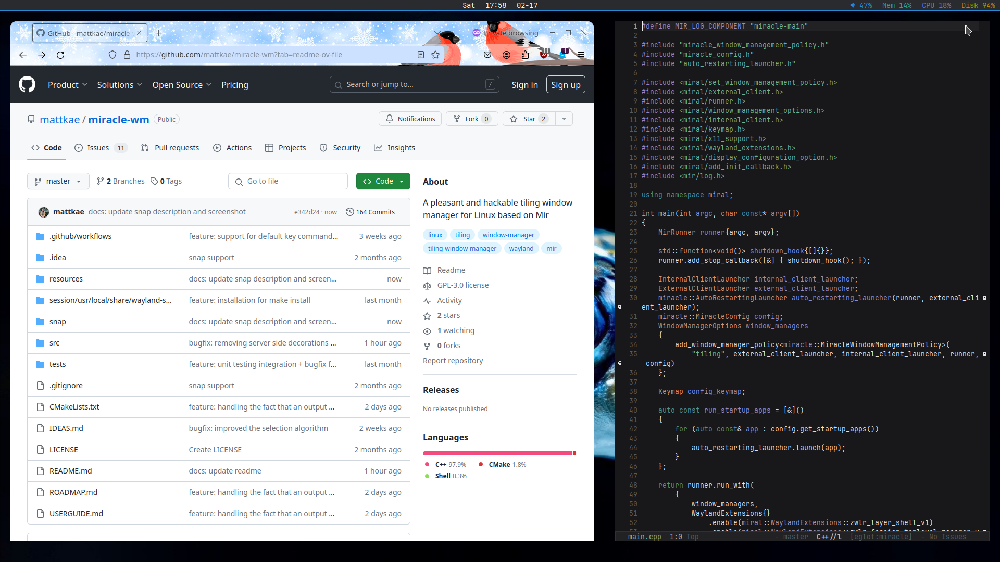

> [!WARNING]
> This project is a work in progress. The first stable, feature-complete release
> will be version 1.0.0. As such, it is advised that you do not use this as your daily driver
> unless you are willing to encounter some paper cuts along the way. If you are willing to 
> lend your time to find bugs, fix bugs, or submit proposals for new features, it would
> be greatly appreciated.

# About
**miracle-wm** is a Wayland compositor based on [Mir](https://github.com/MirServer/mir). It features a tiling
window manager at its core, very much in the style of [i3](https://i3wm.org/) and [sway](https://github.com/swaywm/sway).
The intention is to build a compositor that is flashier and more feature-rich than either of those compositors, like [swayfx](https://github.com/WillPower3309/swayfx).

Please see the [roadmap](./ROADMAP.md) document for the current status and direction of the project.



# Install
```
sudo snap install miracle-wm --edge --classic
```

> [!NOTE]
> While the project is only built as a snap at this moment, I am not allergic to other packaging formats, just perhaps
> too lazy to implement them at this moment. I will happily accept contributions in this domain.

# Usage
See the [user guide](USERGUIDE.md) for info on how to use `miracle-wm`.

# Building
**From Source**:
```sh
git clone https://github.com/mattkae/miracle-wm.git
cd miracle-wm

mkdir build
cd build
cmake ..
WAYLAND_DISPLAY=wayland-98 ./bin/miracle-wm
```

**Snap**:
```sh
cd miracle-wm
snapcraft
sudo snap install --dangerous --classic miracle-wm_*.snap
```

# Running

**On login**:

Once installed, you may select the "Miracle" option from your display manager before you login (e.g. GDM or LightDM).
In most environments, this presents itself as a little "settings" button after you select your name.

Note that if you build directly from source, the option may read "Miracle (Non Snap)" to distinguish it from the snapped version.

**Hosted**:

To run the window manager as a window on your current desktop session, simply run:
```sh
WAYLAND_DISPLAY=wayland-98 miracle-wm
```

Note that this is only useful if you want to test-drive the window manager or do some development on it for yourself.
